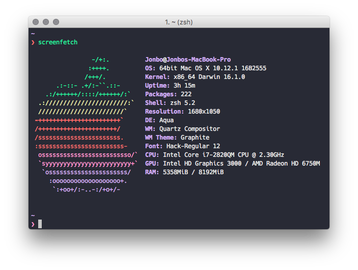

# Jon's Dotfiles

> Dotfiles for MacOS



## How to use these dotfiles

* [Introduction](#introduction)
* [Installation](#installation-protocol)
* [Todo](#todo)
* [Management](#management-overview)
  * [Dotfile Managment](#dotfile-management)
  * [macOS Package Management](#macos-package-management)
  * [ZSH Plugin Management](#zsh-plugin-management)
  * [Node Management](#node-management)
  * [Vim Plugin Management](#vim-plugin-management)
* [Dev Fonts](#dev-fonts)
* [iTerm 2 + ZSH](#iterm-2--zsh)
* [Resources](#resources)

## Introduction

Recently I've discovered the world of [dotfiles](https://dotfiles.github.io/) thanks to [mathias bynens](https://github.com/mathiasbynens/dotfiles/) and [xero](https://github.com/xero/dotfiles). Dotfiles allow you to backup, restore, and sync your dev environment. This is great, especially if you have more than one workstation or are migrating to a new machine. After much research and observation of how other people manage their dotfiles, what you see in this repo is a reflection of their efforts as well as my own.

I initially started this repo to help myself learn more about the tools available out there for customizing my dev environment. I also wanted to make sure that all my customizations were backed up and could be installed on any machine. As I continued learning, adding, and breaking things, I thought it would be a good idea to document as much as I could to not only learn, but help others in setting up their dotfiles as well. I hope this repo can help newcomers understand their own environment and aid them in their own creation of a dotfile repo. Be aware that I am still learning, so proceed with caution. If you are uncertain about anything, I highly advise you read the source before executing any of these scripts.

If you have any improvements or suggestions, please feel free to submit it [here](https://github.com/jonleopard/dotfiles/issues) or [contact me](https://twitter.com/jonlprd)

## Installation

At the moment, this will only work in MacOS. Adding a Linux fork is in my todo. Feel free to help!

**Disclaimer:** If you decide to use these dotfiles, please fork this repo and review the source code before executing! Proceed at your own risk!

1.  Download repo

* via git
* via cURL

2.  Run scripts <--Currently working on these!

* Automatic: ./install.sh
* Manual: stow [folder]

3.  Done!

## Download and Stage Files

If you are just setting up a new machine, you might not already have git installed. If this is the case, then run the cURL command in your home `$HOME` directory. If you already have git, then use git clone. It's imperative you place the dotfiles folder into your home directory. Not sure where that is? Run `echo $HOME`. Read Dotfile Management for more details.

### git

```bash
cd git clone https://github.com/jonleopard/dotfiles.git && cd dotfiles && chmod +x install.sh
```

### curl

```bash
cd curl -#L https://github.com/jonleopard/dotfiles/tarball/master | tar -xzv
```

If you prefer, you can skip the install.sh script and run stow manually. Just tell stow which dotfiles you want to symlink:

```
./stow [foldername]
```

I talk a bit more about stow below in the dotfile management section. Be sure to also check out the links in the resources section.

### Todo

[View the todo board here](https://github.com/jonleopard/dotfiles/projects/1)View the todo board here

## Management Overview

[GNU Stow](https://www.gnu.org/software/stow/) handles all my dotfiles. I'm using that in unison with [Git](https://git-scm.com/) for backups/versioning. [Homebrew](http://brew.sh/) handles all my packages and will also install all of my Mac App Store apps as well. ZSH plugins are managed with [zplug](https://github.com/zplug/zplug). I work a bit with Node, so [NVM](https://github.com/creationix/nvm) was chosen as my Node version manager. Lastly, [Vim-Plug](https://github.com/junegunn/vim-plug) handles all of my Neomvim plugins.

## Dotfile Management

There are [so many flavors](https://www.reddit.com/r/fossworldproblems/comments/2jk4gi/there_are_too_many_solutions_for_managing_dotfiles/) when it comes to dotfile management. I wanted something lightweight and that could run in any \*nix environment with little to no dependencies.

All my dotfiles are managed with the extremely light weight [GNU Stow](https://www.gnu.org/software/stow/). Basically, stow creates & manages symlinks to files that are located in the home directory. This allows me to keep everything in an organized folder called 'dotfiles'. This method makes sharing these files with other users and my other workstations really easy and avoids cluttering the home directory with VCS files.

## MacOS Package Management

Homebrew and Macports are pretty much the only mainstream options here. I went with [Homebrew](http://brew.sh/). My Brewfile with generated with [Homebrew-Bundle](https://github.com/Homebrew/homebrew-bundle). I'm using [Homebrew-Cask](https://github.com/Homebrew/homebrew-bundle) which will go out and install all of the applications that I tell it to. [mas](https://github.com/mas-cli/mas) will install all of your Mac App Store apps. All of this is bundled in a list called Brewfile.

## ZSH Plugin Management

I've tried OMZ(Oh my ZSH), Prezto, and other ZSH frameworks. Since I'd rather know exactly what's going on in my .zshrc file and add only what I need, I chose to go with [zplug](https://github.com/zplug/zplug).

## Node Management

[NVM](https://github.com/creationix/nvm) Allows me to switch between different node versions on the fly. Avoid installing NVM through Homebrew, just use either the cURL or Wget script. Since I'm using ZSH, I added [zsh-nvm](https://github.com/lukechilds/zsh-nvm) to my zplugins.

## Vim Plugin Management

My vim plugins are managed with [Vim-Plug](https://github.com/junegunn/vim-plug). Vim-Plug also ties in nicely with [Neovim](https://github.com/junegunn/vim-plug#neovim). You'll notice that my vim environment is pretty slim at the moment. I'm am still learning how to use vim as my main text editor. So far so good!

## Dev Fonts

Below is a list of some of my favourite dev fonts that go great in your terminal, IDE, Text Editor, etc...

* [Consolas](https://www.typewolf.com/site-of-the-day/fonts/consolas)
* [Hack](https://sourcefoundry.org/hack/)
* [Adobe Source Code Pro](https://github.com/adobe-fonts/source-code-pro)
* [Pragmata Pro](http://www.fsd.it/shop/fonts/pragmatapro/)

If you need a [Powerline](https://github.com/powerline/powerline) font, a list of those can be found here: [Powerline Fonts](https://github.com/powerline/fonts)

## iTerm 2 + ZSH

As you could have guessed by now, I am using [ZSH](http://www.zsh.org/) instead of BASH as my unix shell. I am using [iTerm 2](https://www.iterm2.com/) as my terminal emulator and [Pure Prompt](https://github.com/sindresorhus/pure) as my ZSH prompt.

## Resources

* GNU Stow
  * [Manage Your Dotfile with GNU Stow](https://jonleopard.com/dotfile-management-with-gnu-stow/)
  * [Getting started with dotfiles](https://medium.com/@webprolific/getting-started-with-dotfiles-43c3602fd789#.6u2xwvbpv)
  * [Using gnu stow to manage your dotfiles](http://brandon.invergo.net/news/2012-05-26-using-gnu-stow-to-manage-your-dotfiles.html)
  * [Managing dotfiles with gnu snow](https://alexpearce.me/2016/02/managing-dotfiles-with-stow/)
* Dotfile Repos
  * [mathiasbynens](https://github.com/mathiasbynens/dotfiles/)
  * [xero](https://github.com/xero/dotfiles)
  * [paulirish](https://github.com/paulirish/dotfiles)
  * [thoughtbot dotfiles](https://github.com/thoughtbot/dotfiles)
  * [thoughtbot laptop](https://github.com/thoughtbot/laptop)
* Typography
  * [Font rasterization](https://en.wikipedia.org/wiki/Font_rasterization)
  * [Top 10 Programming Fonts](http://hivelogic.com/articles/top-10-programming-fonts/)
  * [What are the best programming fonts?](https://www.slant.co/topics/67/~programming-fonts)
  * [Programming Fonts](http://programmingfonts.org/)
