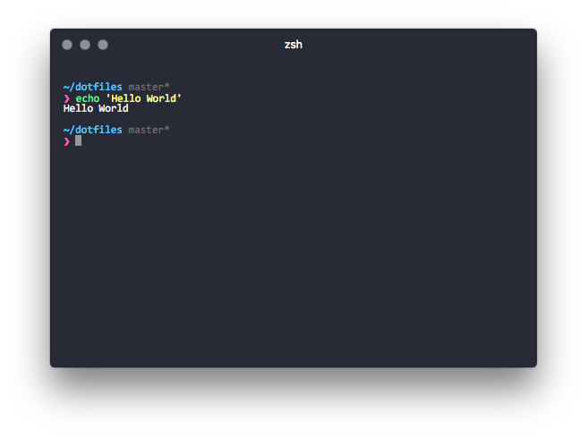

# Dotfiles
> A set up for my Macbook Pro environment (~˘▾˘)~

## Table of Contents
- [Introduction](#introduction)
- [Todo](#todo)
- [Management]
  - [Dotfile Managment](#dotfile-management)
  - [macOS Package Management](#macos-package-management)
  - [ZSH Plugin Management](#zsh-plugin-management)
  - [Node Management](#node-management)
- [Dev Fonts](#dev-fonts)
- [Hyperterm + ZSH](#hyperterm--zsh)
- [Resources](#resources)

## Introduction
Recently I've discovered the world of [dotfiles](https://dotfiles.github.io/) thanks to [mathias bynens](https://github.com/mathiasbynens/dotfiles/) and [xero](https://github.com/xero/dotfiles). With dotfiles, you can backup, restore, and sync your preferences and settings for your toolbox. This is great, especially if you have more than one workstation or just bought a new machine.

This is a work in progress. Eventually, all of my dotfiles will be located in this repo. This is my first time doing all of this, so be cautious if you are duplicating anything. If you have any suggestions or can improve on anything, please feel free to [contact me](https://twitter.com/jonlprd) or make a pull request.

## Todo

- [ ] Add brew.sh file that will install my Homebrew packages and casks
- [ ] Add .vimrc dotfiles
- [ ] Add .osx dotfiles
- [ ] Add .git dotfiles
- [ ] Add .ssh dotfiles
- [ ] Document file structure

## Dotfile Management
There are [so many flavors](https://www.reddit.com/r/fossworldproblems/comments/2jk4gi/there_are_too_many_solutions_for_managing_dotfiles/) when it comes to dotfile management. I wanted something lightweight and that could run in any \*nix environment with little to no dependencies.

All my dotfiles are managed with [GNU Stow](https://www.gnu.org/software/stow/). Its free and extremely lightweight. Basically, stow creates symlinks to all the files located in ~/ and allows me to keep everything in an organized folder called 'dotfiles'. This method makes sharing these files with other users and my other workstations really easy and avoids cluttering the home directory with VCS files.

## macOS Package Management
Homebrew and Macports are pretty much the only mainstream options here. I went with [Homebrew](http://brew.sh/).

## ZSH Plugin Management
I've tried OMZ(Oh my ZSH), Prezto, and other ZSH frameworks. I don't need all that fancy stuff, and I'd rather know exactly what's going on in my .zshrc file and add only what I need. So, that's what I've started here. Take a look inside my .zshrc file to see what plugins I have installed with [zplug](https://github.com/zplug/zplug).

## Node Management
[NVM](https://github.com/creationix/nvm) is awesome and allows me to switch between different node versions on the fly. Avoid installing NVM through Homebrew, just use either the curl or Wget script. Since I'm using ZSH, I added [zsh-nvm](https://github.com/lukechilds/zsh-nvm) to my zplugins.

## Dev Fonts
Below is a list of some of my favourite dev fonts that go great in your terminal, IDE, Text Editor, etc...

- [Consolas](https://www.typewolf.com/site-of-the-day/fonts/consolas)
- [Hack](https://sourcefoundry.org/hack/)
- [Adobe Source Code Pro](https://github.com/adobe-fonts/source-code-pro)
- [Pragmata Pro](http://www.fsd.it/shop/fonts/pragmatapro/)

## Hyperterm + ZSH
As you could have guessed by now, I am using [ZSH](http://www.zsh.org/) instead of BASH as my unix shell. I am using [Hyperterm](https://hyperterm.org/) as my terminal emulator and [Pure Prompt](https://github.com/sindresorhus/pure) as my ZSH prompt.

## Resources
- GNU Stow
  - [Managing your dotfiles with gnu stow](https://codyreichert.github.io/blog/2015/07/07/managing-your-dotfiles-with-gnu-stow/)
  - [Getting started with dotfiles](https://medium.com/@webprolific/getting-started-with-dotfiles-43c3602fd789#.6u2xwvbpv)
  - [Using gnu stow to manage your dotfiles](http://brandon.invergo.net/news/2012-05-26-using-gnu-stow-to-manage-your-dotfiles.html)
  - [Managing dotfiles with gnu snow](https://alexpearce.me/2016/02/managing-dotfiles-with-stow/)
- Dotfile Repos
  - [mathiasbynens](https://github.com/mathiasbynens/dotfiles/)
  - [xero](https://github.com/xero/dotfiles)
  - [paulirish](https://github.com/paulirish/dotfiles)
  - [thoughtbot dotfiles](https://github.com/thoughtbot/dotfiles)
  - [thoughtbot laptop](https://github.com/thoughtbot/laptop)
- Typography
  - [Font rasterization](https://en.wikipedia.org/wiki/Font_rasterization)
  - [Top 10 Programming Fonts](http://hivelogic.com/articles/top-10-programming-fonts/)
  - [What are the best programming fonts?](https://www.slant.co/topics/67/~programming-fonts)
  - [Programming Fonts](http://programmingfonts.org/)
